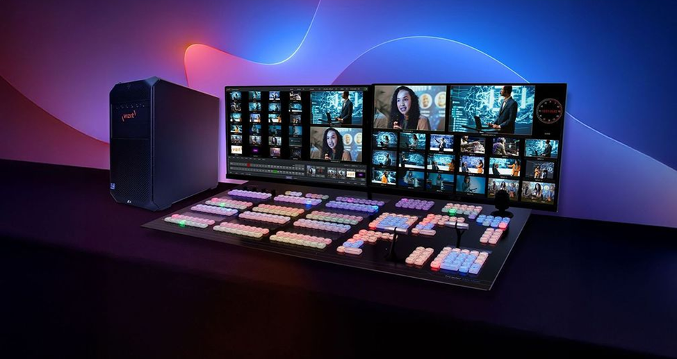

# Tricaster Hướng dẫn Sử dụng

## Tổng quan và Hướng dẫn sử dụng TriCaster

## TriCaster 2 Elite

<figure><figcaption></figcaption></figure>

## Chương 1

## Hướng dẫn sử dụng

Tài liệu hướng dẫn sử dụng TriCaster bao gồm nhiều khía cạnh của việc sản xuất video trực tiếp.

Tham khảo file hướng dẫn gốc. <a href="https://downloads.newtek.com/LiveProductionSystems/TC2Elite/TC2.pdf" class="button primary">Link</a>



Hướng dẫn này cho biết một số thứ cần biết để thực hiện các sử dụng hệ thống sản xuất trực tiếp NewTek. Nó cố gắng truyền tải thông tin cần thiết này một cách thân thiện nhưng ngắn gọn, nếu cần cung cấp một phần tham khảo sâu hơn mà bạn có thể truy cập xem Bản Hướng dẫn sử dụng của NewTek khi bạn thực sự cần thêm chi tiết.

**TRICASTER DOWNLOADS**\
Viz LaunchPad and Viz Remote Control Surface Tool.



**NICE DCV**\
Remote Access Software.



**NDI TOOLS**\
NDI Bridge and other useful NDI applications.



**.NET 7.0 DESKTOP RUNTIME**\
Additional software required for operation.



## Chương 2

## Giới thiệu

### Tổng quan về Màn hình Khởi động (Launch Screen) và Màn hình Trực tiếp (Live Desktop)

### Launch Screen

xuất hiện ngay sau khi bạn bật nguồn hệ thống sản xuất trực tiếp. Đây là trung tâm chỉ huy nơi các dự án sản xuất của bạn được cấu hình và khởi chạy.

<figure><figcaption></figcaption></figure>

Trang chủ của Launch Screen cung cấp một số chức năng quan trọng, đặc biệt là cho phép bạn tạo (và mở lại) phiên session. Session - Phiên là một khái niệm quan trọng - về cơ bản là một cài đặt trước tùy chỉnh được chuẩn bị cho một sản phẩm riêng lẻ hoặc mục đích khác. Sau đó, khi bạn vào lại một phiên hiện có, tất cả nội dung, cài đặt và thậm chí cả trạng thái kiểm soát của phiên đó sẽ được ghi nhớ.

### LIVE DESKTOP

Tất cả các tính năng sản xuất trực tiếp của hệ thống đều có sẵn từ Live Desktop, theo nhiều cách tương tự thiết bị sản xuất video quen thuộc. Tuy nhiên, Live Desktop cung cấp nhiều chức năng hơn trong môi trường tích hợp của nó so với các thiết bị một mục đích tương tự.

Các tính năng, điều khiển và mô-đun khác nhau bao gồm trong Live Desktop được sắp xếp thành các dải theo chiều ngang.

<figure><figcaption></figcaption></figure>

Dải ngang hàng đầu là Dashboard.

• Khu vực ngay bên dưới Dashboard thường dành cho màn hình giám sát nhiều khung hình, cung cấp chế độ xem nguồn và đầu ra.

Khung này có thể được thay đổi kích thước, thậm chí ẩn hoàn toàn; hoặc màn hình có thể được tùy chỉnh để bổ sung cho Multiview(s) bên ngoài, hoặc cho nhiều mục đích khác.

• Trung tâm Live Control là trang chủ của Switcher, Transition, DSKs (overlay channels) và điều khiển M/E (Các khung phần Mix Effect có thể được thu nhỏ và bị ẩn khỏi chế độ xem trực tiếp).

• Theo mặc định, một phần ba dưới cùng của Live Desktop là nơi có các mô-đun điều khiển theo thẻ, bao gồm Media Players, Buffers, và Audio Mixer.

## Chương 3

## Thiết lập

### Hướng dẫn kết nối phần cứng, đăng ký, cập nhật, và cấu hình Audio/Video

Cấu hình và kiểm tra bàn điều khiển: nhấn SHIFT + ALT + SET

#### Kết nối Phần cứng

* **Yêu cầu Màn hình:** Giao diện người dùng (User Interface) của TriCaster yêu cầu màn hình có độ phân giải tối thiểu là **1920x1080**.
* **Kết nối Nguồn A/V (Chương 3.6, 3.8, 3.9):**&#x20;
* Kết nối nguồn video (máy ảnh, máy tính, v.v.) và âm thanh của bạn vào các cổng vật lý (ví dụ: SDI, HDMI) hoặc qua mạng bằng **NDI** (Network Device Interface). NDI mang lại khả năng đầu vào và đầu ra gần như không giới hạn.
* Kết nối các màn hình đầu ra (Program Monitor, Multiview) của bạn.
*   **Đăng ký và Cập nhật (Chương 3.3, 3.4):** Đảm bảo bạn đã kích hoạt giấy phép (License) của TriCaster và kiểm tra các bản cập nhật hệ thống.

    [https://www.vizrt.com/support/product-updates/](https://www.vizrt.com/support/product-updates/)

#### Bắt đầu Phiên làm việc (Session)



### Khởi động và vào Launch Screen

Khởi động TriCaster để vào **Màn hình Khởi động** (Launch Screen).

<figure><figcaption></figcaption></figure>



### Tạo hoặc mở Phiên

Chọn **Tạo Phiên làm việc mới** (Create New Session) hoặc **Mở Phiên làm việc hiện có** (Open Existing Session) trên **Trang Chủ** (Home Page).



### Vào Live Desktop

Sau khi tạo/mở, hệ thống sẽ chuyển đến **Màn hình Trực tiếp** (Live Desktop).



#### Cấu hình Đầu vào (Input Configuration)

Cấu hình đầu vào được thực hiện trong tab **Input** của bảng **Setup** (Chương 8).

<figure><figcaption></figcaption></figure>

1. Trên **Màn hình Trực tiếp (Live Desktop)**, nhấp vào nút **Setup** (Thiết lập) trên **Dashboard**.
2.  Trong giao diện **Cấu hình I/O (I/O Configuration)**, chọn tab **Input** (Đầu vào).

    <figure><figcaption></figcaption></figure>

    Để truy cập toàn bộ các tùy chọn cấu hình và tính năng cho một đầu vào cụ thể, hãy nhấp vào bánh răng cấu hình trong cột "Cấu hình" ở ngoài cùng bên phải cho từng đầu vào riêng lẻ.
3. Chọn nguồn: tại đây, có thể:
   * **Gán Nguồn Source:** Gán bất kỳ nguồn nào (ví dụ: NDI ngoài, Skype TX Caller, nguồn phần cứng cục bộ) một cách linh hoạt cho bất kỳ đầu vào Switcher nào.
   * **Chọn Loại Kết nối:** Đối với các nguồn không phải NDI, có thể cần chọn phương thức kết nối và cài đặt tùy chọn.
4.  Cấu hình Đầu ra (Output Configuration):

    <figure><figcaption></figcaption></figure>

Cấu hình đầu ra được thực hiện trong tab **Output** của bảng **Setup** (Chương 8).

* Có thể cấu hình các **Đầu ra Chính** (Primary Outputs) và **Đầu ra Bổ sung** (Supplemental Outputs).
* Sử dụng tính năng **Sync** (Đồng bộ) trong tab **Sync** để đồng bộ đầu ra video của TriCaster với tín hiệu đồng bộ ngoài (Genlock) nếu cần thiết.

<figure><figcaption></figcaption></figure>

Các ngõ ra có thể gán:

* Preview
* Luồng từ bất kỳ input
* Ngõ ra Graphic hay video output từ Media Player
* Mix Effect
* Ngõ ra trực tiếp Direct output từ M/E bất kỳ
* Ngõ ra sạch Clean output từ M/E bất kỳ
* Ngõ ra Output bộ Buffer bất kỳ
* Tùy chọn M/E Program hay Preview tương ứng
* Black

#### Cấu hình Âm thanh

Bấm vào tab _Bộ trộn âm thanh_ (được đặt chính giữa ở một phần ba dưới của _Live Desktop_) để hiển thị các tính năng âm thanh, bao gồm các điều khiển cấu hình cho tất cả các nguồn và đầu ra âm thanh bên trong và bên ngoài, bao gồm cả phát trực tuyến.

<figure><figcaption></figcaption></figure>

Mỗi đầu vào và đầu ra có cột điều khiển riêng với các _Volume_ slider, VU meter, và các tính năng tiện lợi khác. Một nhãn tên nhận dạng nằm ở đầu mỗi bảng điều khiển.

Di con trỏ chuột qua nhãn để hiển thị _Configuration button_ (bánh răng) ở bên phải, khi được nhấp, sẽ mở _Configuration_ bảng điều khiển cho đầu vào.

<figure><figcaption></figcaption></figure>

Trong bảng điều khiển thứ hai này, hãy nhấp vào biểu tượng _Connection_ menu để hiển thị các tùy chọn cho đầu vào, sẽ thấy các đầu vào phần cứng cục bộ được liệt kê trong _Local_ group như “IN 1”, “IN 2”, v.v.

Kết nối cục bộ trong một số kiểu máy có thể được chỉ định để 'nghe' nguồn âm thanh nhúng HDMI được kết nối với đầu vào video tương ứng hoặc đầu vào âm thanh tương tự được cung cấp trên thiết bị.

#### Cấu hình NDI Genlock

<figure><figcaption></figcaption></figure>

Tính năng Đồng bộ hóa Sync cho phép TriCaster 'khóa' đầu ra video hoặc tín hiệu NDI của nó, với thời gian bắt nguồn từ tín hiệu tham chiếu bên ngoài (đồng bộ hóa cục bộ, chẳng hạn như black burst ) được cung cấp cho đầu nối đầu vào genlock của nó.

Điều này cho phép đầu ra TriCaster được đồng bộ hóa với các thiết bị bên ngoài khác bị khóa vào cùng một tham chiếu. TriCaster đi kèm với các tùy chọn bổ sung để Đồng bộ hóa, menu kéo xuống tập trung tất cả các tùy chọn đồng bộ hóa một cách thuận tiện và cho phép thay đổi chúng một cách nhanh chóng.

Khi genlocking đang hoạt động và được định cấu hình đúng cách, mã thời gian trên _thanh tiêu đề_ sẽ hiển thị màu xanh lục.

<figure><figcaption></figcaption></figure>

## Chương 4

## Các tính năng Web | Bảo vệ bằng mật khẩu, LivePanel, nội dung và đào tạo video có giá trị

Tuy nhiên, trước tiên, hãy lưu ý rằng (vì lý do bảo mật) các tính năng có thể kiểm soát quá trình sản xuất qua mạng được bảo vệ bằng mật khẩu theo mặc định.

Ban đầu, tên người dùng và mật khẩu đều được đặt thành "**admin**"

<figure><figcaption></figcaption></figure>

## Chương 5

## Màn hình Khởi động | Giới thiệu về Phiên làm việc (Sessions), Tạo/Mở Phiên làm việc mới, Add-Ons, và Cấu hình

Màn hình khởi chạy là cổng vào một bộ ứng dụng, chẳng hạn như bảo trì, tính năng quản lý, hỗ trợ HDR và Cấu hình thẻ I/O cho cả phiên và hệ thống.

Màn hình khởi chạy _Home Page_ xuất hiện bất cứ khi nào bạn khởi chạy TriCaster của mình. Từ màn hình này, sẽ tạo và khởi chạy _sessions_, Sau đó, chọn loại thao tác bạn muốn thực hiện trong đó bằng cách chọn một liên kết trên (tương tự) _Session Page_.

Ý định của bạn có thể là bắt đầu một sản phẩm trực tiếp mới hoặc sản xuất một tập khác của một loạt quay trực tiếp. Hay muốn chuẩn bị các trang tiêu đề cho một sự kiện sắp tới hoặc thực hiện bảo trì hệ thống.

Trước tiên chúng ta hãy xem xét một khái niệm sản xuất cơ bản, _session_. Phiên _session_ là gì và tại sao các phiên vừa quan trọng vừa có giá trị đối?

Bất kỳ sản xuất nào cũng liên quan đến một môi trường hoạt động cụ thể. _Phiên này_ là nơi TriCaster lưu trữ các chi tiết của môi trường đó. Do đó, rõ ràng, cấu hình cài đặt phiên đúng cách là rất quan trọng:

1. Tiêu chuẩn phát sóng nào được sử dụng ở ngôn ngữ của bạn? Đó có phải là _PAL_, phổ biến ở châu Âu trong số những nơi khác, hay có lẽ là _tiêu chuẩn NTSC_ trên khắp Bắc Mỹ?
2. Máy quay có được kết nối bằng đầu vào phần cứng (trên các kiểu máy hỗ trợ), NDI hay kết hợp cả hai loại kết nối không?

<figure><figcaption></figcaption></figure>

<figure><figcaption></figcaption></figure>

Chọn PAL HD và 1080/50i, SDR

<figure><figcaption></figcaption></figure>

<figure><figcaption></figcaption></figure>

Thông thường, vài giây sau khi khởi động chạy, TriCaster sẽ tự động tải lại phiên cuối cùng mà bạn đã tham gia, cho phép bạn về cơ bản sử dụng phiên cuối cùng mà không cần giám sát. Tất nhiên, bạn có thể làm gián đoạn quá trình này bằng cách chọn một phiên khác hoặc nhấn bất kỳ phím nào.

Người dùng nâng cao có thể sửa đổi hành vi này, bằng cách chỉ định một phiên cụ thể để tự động khởi chạy bất kể lựa chọn thủ công gần đây nhất hoặc bằng cách tắt hoàn toàn tính năng này.&#x20;

<figure><figcaption></figcaption></figure>

Các phiên có sẵn được nhóm trên _Session Page_ dưới tên của ổ đĩa lưu trữ mà chúng được đặt trên đó. Danh sách hiển thị _Session Name_ và _Format_ cho mỗi phiên, trên mỗi ổ đĩa. Phía trên danh sách là một tùy chọn để tìm kiếm một phiên riêng lẻ. Cho phép xem xét _Sessions List_ ngắn gọn trước khi chúng ta mở một phiên.

<figure><figcaption></figcaption></figure>

_Manage Session_ trong biểu tượng nhóm _Session Details_ cung cấp một cách tiếp cận thay thế để quản lý tệp. Đôi khi, bạn có thể thấy hữu ích khi có thể truy cập nhanh các tệp khác nhau được liên kết với các phiên cụ thể.

Chọn bánh xe _Manage Session_ cung cấp các tùy chọn với một số chức năng tiện lợi.

### Backup Session

Chọn _Backup Session_ Liên kết mở một hệ thống File Explorer mà bạn có thể sử dụng để gán vị trí lưu trữ cho các tệp sao lưu. Một thước đo tiến độ được hiển thị trong quá trình xử lý và nếu cần, bạn có thể _Hủy_ hoạt động. Tất nhiên, phiên được sao lưu là phiên hiện tại (để sao lưu một phiên khác, hãy quay lại Trang _chủ_ và _Mở_ một phiên khác).

### Add-Ons

Vizrt cung cấp các công cụ phần mềm bổ sung để mở rộng sức mạnh của hệ thống TriCaster của bạn. Biểu tượng có nhãn _Tiện ích bổ sung Add-Ons_ trên _Trang chủ_ cung cấp quyền truy cập vào một số công cụ này.

Khi bạn chọn biểu tượng _Tiện ích bổ sung Add-Ons_, các liên kết được hiển thị ở bên phải cho các ứng dụng phần mềm đã cài đặt, cho phép bạn khởi chạy chúng.

<figure><figcaption></figcaption></figure>

### Thoát khỏi TriCaster

<figure><figcaption></figcaption></figure>



### Exit to Windows

Rời khỏi màn hình _Khởi chạy_ và hiển thị màn hình hệ thống tiêu chuẩn.



### Restart TriCaster

Khởi động lại hệ thống.



### Shutdown TriCaster

Tắt hệ thống.



## Chương 6

## Màn hình Trực tiếp | Yêu cầu hiển thị, tổng quan và tùy chỉnh giao diện

<figure><figcaption></figcaption></figure>

_Live Desktop_ cung cấp phản hồi trực quan cho các hoạt động, bao gồm giám sát, chuyển hình trực tiếp, v.v. Mặc dù hiếm khi cần thiết để nó xuất hiện nhiều như hình trên, nhưng chúng tôi hiển thị nó theo cách này để minh họa rằng nó có thể được chia thành năm dải ngang, được mô tả từ trên xuống dưới trong bảng sau.

### Dashboard

Truy cập nhanh vào các tùy chọn giao diện và các công cụ quan trọng, bao gồm Publish và Macros (hay Commands) cùng với Record, Stream, Workspace và Timecode options.

### Monitors

Bố cục có thể định cấu hình của người dùng - theo dõi đầu vào trực tiếp cùng với các nguồn nội bộ (chẳng hạn như _DDRs_, _M/Es_, và _Buffers_) thêm _Look Ahead Preview_ và _Program output, Waveform_ và _Vectorscope_.

### M/E & Matrix Router

_Effect_ mode – Kiểm soát tối đa bốn lớp video chính cộng với 4 kênh lớp phủ.

_Mix_ mode – Điều khiển bộ chuyển đổi thứ cấp cộng với 4 kênh lớp phủ.

Mỗi _M/E_ bao gồm một sự bổ sung của _Keyers_, Trình tạo chuyển tiếp, bộ chia tỷ lệ / bộ định vị, v.v.

Hai bộ định tuyến ma trận (OUTPUTS 1-4 & 5-8) cung cấp tám điểm chuyển chéo có thể định tuyến với đầu ra NDI (thay đổi tùy theo kiểu máy).

### Switching

Hàng nút bộ chuyển đổi – hàng nút Program và Preview.

Transition controls – T-bar và các nút Delegate.

DSK Cấu hình và điều khiển lớp video.

### Mô-đun điều khiển theo tab

Trình phát và bộ đệm _phương tiện nội bộ Local_.

PTZ (robotic) camera controls.

Audio (mixer) – cấu hình đầu vào, điều khiển mức, EQ và Compressor/Limiters.

### Đổi tên đầu vào

Mở rộng _Name/Comment_ group trong tệp _Input_ tab của _Input Configuration_ bảng điều khiển, bằng cách nhấp vào hình tam giác xoay xuống ở bên trái. Nhóm này chứa một số trường văn bản có thể chỉnh sửa, bao gồm _Video_ (Nhãn hiển thị dưới màn hình), nhãn ngắn hơn Switcher _Button_, và nhãn dài _Comment_.

<figure><figcaption></figcaption></figure>

### Workspaces

Các bố cục khác nhau và các tùy chọn giám sát tùy chỉnh cho _Live Desktop_ và _Multiviews_ được cung cấp trong tệp _Workspace_ menu.

Khi một hoặc nhiều _Multiviews_ màn hình đang được sử dụng, _Workspace có các_ tùy chọn đặt trước có thể được kết hợp với tính linh hoạt cao, cho phép bạn xem _nội dung_ bạn muốn xem ở _đâu_ khi muốn xem.

<figure><figcaption></figcaption></figure>

<figure><figcaption></figcaption></figure>

## Chương 7

## Dashboard | Menu File, Options, Macros/Commands, Workspaces, Đồng hồ và Thông báo

### Dashboard

là nơi có một số màn hình, công cụ và điều khiển quan trọng. Nằm nổi bật ở trên cùng của Live Desktop, nó chiếm toàn bộ chiều rộng của màn hình.

<figure><figcaption></figcaption></figure>

Nửa bên phải của _Bảng điều khiển_ Dashboard chứa các tính năng và công cụ bổ sung được truy cập thường xuyên hơn, vì lý do đó chúng được hiển thị toàn thời gian. Các yếu tố khác nhau bao gồm toàn bộ _Bảng điều khiển_ Dashboard được liệt kê bên dưới (bắt đầu từ bên trái)

<figure><figcaption></figcaption></figure>

## Chương 8

## Cấu hình I/O

### Cấu hình Đầu vào, Đầu ra, Ghi & Chụp (Record & Grab), và Đồng bộ hóa

Hệ thống TriCaster của bạn cung cấp khả năng kiểm soát rộng rãi các nguồn video, cùng với các tính năng sáng tạo vô tận. Mỗi nguồn đều có các tính năng Proc Amp, keyer (LiveMatte) và Crop (hay còn gọi là 'lớp cắt mờ'). Số lượng và tính linh hoạt của các đầu ra được cung cấp cũng rất nhiều.

Tab Cài đặt hoàn toàn mới cho phép bạn quản lý đầu vào, đầu ra, SDI và trong các kiểu máy hỗ trợ - đầu ra có thể lập trình và cài đặt màu HDR ở một nơi. Thiết kế này giúp giảm nhu cầu điều hướng qua nhiều menu, giúp quy trình sản xuất hiệu quả hơn.

Hỗ trợ NDI cung cấp cho bạn khả năng đầu vào và đầu ra gần như không giới hạn. Nói chung, một nguồn NDI cần ít cấu hình; Các loại nguồn khác có thể yêu cầu bạn chọn giữa các phương thức kết nối và cài đặt tùy chọn.

### Input tab

TriCaster Vizion có _tab Đầu vào Input_ trong Bảng cài đặt, nhấp vào _tab Cài đặt Setup_ nằm trong _Bảng điều khiển Dashboard_ và sau đó nhấp vào _tab Đầu vào_.

<figure><figcaption></figcaption></figure>

Nhấp vào biểu tượng cấu hình (bánh răng) hiển thị ở phía dưới bên phải khi con trỏ chuột được cuộn qua phía trên cổng cần cấu hình

<figure><figcaption></figcaption></figure>

Nhóm Cục bộ Local trong menu Nguồn Source (hiển thị bên dưới) bao gồm các nguồn được kết nối cục bộ với đầu vào phần cứng của hệ thống, bất kỳ nguồn phần cứng cục bộ nào khác được phát hiện (chẳng hạn như webcam), ứng dụng hội nghị truyền hình, cùng với các kết nối Skype TX Caller được lưu trữ bởi hệ thống cục bộ và Ngõ Màu đen Black

<figure><figcaption></figcaption></figure>

### Record

<figure><figcaption></figcaption></figure>

Các hệ thống sản xuất trực tiếp của TriCaster cung cấp rất nhiều tính linh hoạt khi nắm bắt chương trình của bạn, các yếu tố được chọn của nó và một loạt các nguồn bên trong và bên ngoài (với mã thời gian TC được nhúng).

### Công nghệ IsoCorder

mang lại khả năng ghi hình mạnh mẽ.

Đầu ra chính của TriCaster có thể định cấu hình; bạn có thể chụp _Chương trình_, _Chương trình (Sạch),_ các nguồn _Bộ chuyển đổi_ riêng lẻ, các _M/E, v.v. Tùy thuộc vào kiểu máy TriCaster của bạn, bạn có thể quay đồng thời tối đa tám nguồn video "Mix" như vậy và cũng có thể chụp các nguồn Switcher riêng lẻ (khả năng ghi khác nhau tùy theo kiểu máy và cũng bị ảnh hưởng bởi băng thông và dung lượng lưu trữ)._

<figure><figcaption></figcaption></figure>

<figure><figcaption></figcaption></figure>

### Replay

<figure><figcaption></figcaption></figure>

_Replay Duration_ – xác định độ dài của các clip phát lại được thêm vào _DDR_

_Replay Speed_ – đặt tốc độ phát lại cho các clip được thêm vào _DDR_ bằng quy trình phát lại

_Replay in DDR_ – chọn DDR làm mục tiêu để phát lại clip phát lại

### Title Template

Bạn có thể tạo tiêu đề và đồ họa tĩnh trong Adobe Photoshop hoặc các ứng dụng vẽ và đồ họa phổ biến khác, đồng thời hiển thị chúng dưới dạng hình ảnh trong (ví dụ) _DSK_.

Tuy nhiên, thay vào đó, bạn sẽ thấy hữu ích khi tạo một trang tiêu đề _có thể chỉnh sửa_ trong Photoshop, sau khi được tải và biên dịch bởi TriCaster dưới dạng tệp CGXML gốc, hoạt động giống như những trang được cung cấp cùng với hệ thống của bạn. Văn bản vẫn có thể chỉnh sửa và hình ảnh được nhúng cũng có thể được đánh dấu là có thể thay thế.

<figure><figcaption></figcaption></figure>

## Chương 9

## Switcher, Chuyển cảnh và Lớp phủ (Overlay)

### Các chế độ Switcher, Lớp nền (Background) và DSK, Comps/MEMs

<figure><figcaption></figcaption></figure>

Các Live Desktop có các tính năng tái tạo các điều khiển trình chuyển đổi video truyền thống theo cách dễ hiểu và dễ sử dụng. Live Desktop có các điều khiển chuyển tiếp mạnh mẽ, các kênh lớp phủ xuôi dòng, màn hình lớp tương tác và các tính năng tự động hóa mạnh mẽ.

Phần trung tâm của _Live Desktop_ (giữa phần giám sát và các mô-đun theo thẻ) được sử dụng bởi _Switcher_ và các điều khiển và tính năng liên quan, bao gồm _Layer Controls_, bao gồm main và _DSK_ (Downstream Keyer) Các tính năng điều khiển _Transition_ và cấu hình.

### Phần chọn hình

<figure><figcaption></figcaption></figure>

Theo tiêu chuẩn _Switcher_ mode, hai hàng _Switcher_ được gắn nhãn _PGM_ (Program), và _PREV_ (Xem trước). Bấm vào nút trong hàng _Chương trình PGM_ hoặc _Xem trước PREV_ sẽ chọn nguồn video đang hoạt động cho bus đó (lưu ý rằng các nguồn âm thanh có thể tùy chọn bị ảnh hưởng bởi _hoạt động_ của Trình chuyển đổi).

Các hàng Chương trình và Xem trước của TriCaster đại diện cho tất cả các nguồn video có sẵn trong "BANK" các nút. Số lượng nút trong BANK thay đổi tùy theo số lượng nguồn mà mỗi mô hình hỗ trợ. BANK _1_ được hiển thị theo mặc định. Nhấn giữ _Alt_ trên bàn phím sẽ hiển thị BANK _2_. Khi thả nút _Alt_, _Bank 1_ sẽ được hiển thị lại. Nhấn _ALT + CTRL_ để hiển thị BANK _3_ trong giây lát khi được hỗ trợ. Có thể 'chốt khóa' BANK, bằng cách nhấp vào các nút BANK trên màn hình hoặc bằng cách nhấn _Tab_ để xoay vòng BANK hiện đang hiển thị.

### Các lớp nền Background và DSK

Khái niệm về _các lớp video_ là trọng tâm để hiểu cách các điều khiển _Switcher, M/E_ và _Transition_ liên quan đến nhau và cách chúng kết hợp để tạo thành video được nhìn thấy trên _đầu ra_ Chương trình.

* Lớp _Nền_ (BKGD) luôn là cơ sở cho bố cục video được hiển thị trên _đầu ra_ Chương trình.
* _Các layer DSK_ (Down Stream Keyer hoặc 'overlay') có thể xuất hiện phía trên (phía trước) Background.

Các lớp DSK thường được sử dụng để phủ đồ họa, tiêu đề, v.v., mặc dù chúng cũng có thể phục vụ các mục đích khác. Ngoài BKGD, tối đa năm 'lớp chính' bổ sung (thay đổi theo kiểu máy) có thể đóng góp vào đầu ra Program cuối cùng tại bất kỳ thời điểm nào:

* Các lớp phủ (DSK) được cấu tạo phía trên lớp BKGD trên đầu ra. DSK 2 xuất hiện 'trước' DSK 1 trên Đầu ra chương trình — nghĩa là gần nhất với người xem — v.v. theo thứ tự.
* FTB (Fade to Black) tạo thành một lớp phủ cuối cùng — một lớp che khuất tất cả các lớp khác khi áp dụng.

<figure><figcaption></figcaption></figure>

Cũng nên nhớ rằng bản thân lớp _BKGD_ thường là một tổ hợp của các lớp con:

* Nó có thể bao gồm video hỗn hợp từ cả _hai hàng_ Program hay Preview.
* Chọn _M/E_ làm nguồn trên _Program_ or _Preview_ có thể thêm nhiều lớp con vào thành phần _BKGD_, bao gồm _Đầu vào_ chính của _M/E và các lớp KEY chuyên dụng_.

<figure><figcaption></figcaption></figure>

Mỗi lớp _DSK_ có một chế độ xem video trực tiếp hiển thị nguồn hiện tại được gán cho nó (sử dụng menu ngay phía trên khung nhìn) và hiệu ứng chuyển tiếp của riêng nó.

Nhấp vào biểu tượng chuyển tiếp ở phía dưới bên trái bên dưới viewport để hiển thị bảng màu các cài đặt trước chuyển tiếp khác nhau được cung cấp để lựa chọn nhanh.

Nhấp vào một mục trong bảng màu để chọn hoặc di chuyển con trỏ chuột đến dấu "+" bật lên cho mỗi biểu tượng và nhấp để mở _Custom Media Browser._

<figure><figcaption></figcaption></figure>

Bạn cũng có thể kiểm soát tiến trình chuyển đổi bằng cách sử dụng _điều khiển T-Bar_ của Bộ chuyển đổi, ở bên trái. _T-Bar_ hoạt động trên tất cả các _lớp video được ủy quyền_. Để ủy quyền DSK, hãy nhấp vào nhãn của DSK ở phía trên bên trái để chuyển sang màu xanh lam. Nhấp vào nó lần thứ hai sẽ hủy ủy quyền layer.

_T-Bar_ hoạt động trên tất cả các lớp được ủy quyền, bao gồm cả lớp Video nền. Ví dụ: nếu _DSK 1_ hiển thị, nhưng _DSK 2_ thì không, khi cả _DSK_ và _BKGD_ đều được ủy quyền, thực hiện thao tác T-Bar (hoặc BKGD AUTO) sẽ đảo ngược khả năng hiển thị của hai _DSK trên đầu ra Chương trình_ khi quá trình chuyển đổi _BKGD_ xảy ra.

<figure><figcaption></figcaption></figure>

Mỗi thời gian chuyển tiếp được đặt và lưu trữ trong bảng hiệu ứng, sử dụng điều khiển thời lượng số bên cạnh biểu tượng hiệu ứng.

Chọn tốc độ chuyển tiếp bằng cách sử dụng menu bên dưới _Transition Palette_. Bạn cũng có thể kéo con trỏ chuột qua màn hình số để đặt thời gian tùy chỉnh hoặc bấm vào nó để bật nhập bàn phím về thời lượng hiệu ứng.

### Cấu hình nguồn DSK

<figure><figcaption></figcaption></figure>

Nhiều tùy chọn cấu hình khác có sẵn cho _DSK (và các lớp phím M/E)_.

Để truy cập các cài đặt và tính năng này, hãy di con trỏ chuột qua _DSK_ viewport và nhấp vào tiện ích cấu hình (bánh răng) xuất hiện ở phía dưới bên phải.

Làm như vậy sẽ mở _Input Configuration_ bảng điều khiển cho nguồn được gán cho _DSK_, nhưng có thêm một tab bổ sung có nhãn DSK (1-2).

Các nhóm điều khiển trong tab mới này mở rộng để hiển thị _Position_, _Crop, Apply with COMP_, _Borders, Edges and Shadows_.

### Vị trí (và cắt hình)

.png>)

Nhóm kiểm soát vị trí bao gồm _Position_, _Zoom, Rotation_, và _Priority_. _Position_ Cài đặt có thể được bật và tắt cùng nhau bằng cách sử dụng công tắc được cung cấp trong tiêu đề nhóm.

Nhấp và kéo vào _Position_ nút (kim cương) để di chuyển lớp _DSK_ theo chiều dọc hoặc chiều ngang trong khung.

Kéo sang trái hoặc phải trên một trong hai điều khiển số gần đó để chỉ điều chỉnh một trục duy nhất.

Kéo con trỏ trên _Zoom_ nút (kính lúp) ảnh hưởng đến kích thước biểu kiến của lớp phủ. Nếu bạn chỉ kéo một trong các tiện ích số được liên kết, bạn có thể điều chỉnh chỉ một chiều của lớp _DSK_ tương ứng — chiều rộng hoặc chiều cao.

_Các layer DSK_ và KEY tự động xuất hiện trên _Preview_ và (_M/E Preview_) giám sát khi _Position_ bảng điều khiển đang mở (bất kể tùy chọn hiển thị lớp). Điều này cho phép bạn sửa đổi layer mà không có kết quả vô tình hiển thị trên đầu ra.

### Comps và MEMs

Bạn cũng sẽ nhận thấy một nút có nhãn _COMP_ ngay phía trên _T-Bar_ (Bộ chuyển đổi chính được bao gồm trên một số kiểu máy nhất định). Nhấp vào nó sẽ mở _Comp Bin_, cung cấp các tính năng kiểm soát lớp và hiệu ứng mạnh mẽ.

Phân biệt _Comps_ với Switcher _MEM_. Nhấn con trỏ ở cạnh trái của màn hình liền kề với _Switcher_ hoặc _M/E_ sẽ hiển thị một _thùng MEM_ với các tính năng khá giống nhau.

Sự khác biệt chính giữa _MEM_ và _Comps_ là cái trước giữ lại (và áp dụng) tất cả các cài đặt trong _Switcher_ — bao gồm cả lựa chọn nguồn.

### Chuyển đổi nền

<figure><figcaption></figcaption></figure>

Bộ chọn tứ giác nằm giữa hàng _Switcher_ và các điều khiển _DSK_ ở bên phải. _Cut_ và _Bộ chọn chế độ Crossfade_ đứng đầu nhóm điều khiển này. Chỉ cần nhấp hoặc nhấn vào các nút _Cut_ hoặc _Crossfade_ để kích hoạt _Background transition_.

### Giao diện và Multiview

<figure><figcaption></figcaption></figure>

_Live Desktop_ Cung cấp một số màn hình đa hình hiển thị — một trên _Live Desktop_ (hay còn gọi là "Giao diện"), thường bao gồm một phần ba trên của nó và các màn hình khác bao gồm các màn hình hoàn toàn độc lập được trình bày trên đầu ra màn hình phụ trên bảng kết nối phía sau (số lượng đa chế độ xem thay đổi tùy theo kiểu máy).

<figure><figcaption></figcaption></figure>

## Chương 10

### ... các chức năng khác

Giám sát Video, Media Players & Buffers, LiveGraphics, LiveMatte, Công cụ Mix/Effect (M/E), Âm thanh, Macros, Live Story Creator, Stream/Encode, Record/Grab/Replay, v.v.

### Interface and Multiview

<figure><figcaption></figcaption></figure>

Live Desktop Cung cấp một số màn hình đa quan sát — một trên Live Desktop (hay còn gọi là "Giao diện"), thường bao gồm một phần ba trên của nó và các màn hình khác bao gồm các màn hình hoàn toàn độc lập được trình bày trên đầu ra màn hình phụ trên bảng kết nối phía sau.

### Scopes

<figure><figcaption></figcaption></figure>

Scopes đại diện cho một tùy chọn giám sát rất hữu ích, cung cấp hiển Waveform và Vectorscope.

### Program Monitor

#### Program Output

màn hình quan trọng, do đó nó là vị trí mặc định nổi bật ở phía trên bên phải trên Màn hình nền.

Thông thường, viewport này hiển thị những gì Switcher đang gửi đến Program output bất cứ lúc nào. Màn hình bao gồm lớp video BKGD cũng như bất kỳ lớp video nào khác (chẳng hạn như một hoặc nhiều DSK hoặc FTB) được hiển thị phía trên.

Theo mặc định, Program output được gửi đến đầu ra MIX 1, tùy thuộc vào các nhiệm vụ được thực hiện trong Output Configuration. Khi bạn di chuyển con trỏ chuột qua Program monitor, Nút cấu hình (bánh răng) xuất hiện ở phía dưới bên phải. Nhấp vào nút này sẽ mở tệp Configuration panel.

### Media Players & Buffers

Media Players Cho phép bạn tích hợp video, ảnh tĩnh và trang tiêu đề vào bản trình bày trực tiếp của mình. Hiển thị phương tiện media tuần tự dưới dạng danh sách phát hoặc theo yêu cầu. Trình phát đa phương tiện có thể phát, dừng và tự động tiến lên để đáp ứng các hoạt động của Bộ chuyển đổi. Hiệu ứng bộ đệm hoạt hình hoàn hảo cho nhiều mục đích tương tự, giải phóng Media Player để sử dụng để phát lại dạng dài.

<figure><figcaption></figcaption></figure>

<figure><figcaption></figcaption></figure>

#### Media Player

có thể xử lý nhiều loại phương tiện:

* Các DDR có thể hiển thị:
  * Video clips – bao gồm các hiệu ứng, tiêu đề chuyển động như cuộn, chuyển tiếp, hỗ trợ LiveGFX và 'phim' định dạng dài hơn.
  * Title và ảnh tĩnh – các trang tiêu đề có thể chỉnh sửa được chuẩn bị để sử dụng trong hệ thống tiêu đề gốc của NewTek, các trang CG được chuẩn bị dưới dạng tệp hình ảnh hoặc hình ảnh tĩnh khác — ảnh, đồ họa, v.v.
  * Cả trình phát âm thanh và DDR đều có thể phát các tệp âm thanh định dạng .wav hoặc .mp3 tiêu chuẩn.

#### Playlists

Tính năng nổi bật của tất cả các Trình phát đa phương tiện Media Player là danh sách phát kiểu bảng phân cảnh, được sử dụng để sắp xếp nội dung để sử dụng trong quá trình sản xuất trực tiếp.

<figure><figcaption></figcaption></figure>

#### LiveMatte

Mặc dù các điều khiển của nó có vẻ đơn giản, nhưng tính năng LiveMatte™ sử dụng công nghệ xử lý màu mạnh mẽ, có khả năng mang lại kết quả chất lượng cực cao. Được sử dụng riêng lẻ hoặc kết hợp với DSK, M/E Overlays và các tính năng LiveSet, LiveMatte có thể đóng một vai trò quan trọng trong các sản phẩm trực tiếp.

<figure><figcaption></figcaption></figure>

Chromakeying — hoặc đơn giản là "keying" — được sử dụng để kết hợp hình ảnh bằng cách loại bỏ một phần của hình ảnh tiền cảnh để tiết lộ một nền khác. Phương pháp này cũng được sử dụng để chèn vật thể một cách liền mạch vào các bộ ảo thông qua LiveSet™.

Các điều khiển LiveMatte™ nằm trong một nhóm có thể mở rộng trong Image tab của Input Configuration bảng điều khiển cho từng nguồn Switcher. Để truy cập chúng, hãy nhấp vào nút Định cấu hình (bánh răng) xuất hiện phía trên màn hình trên màn hình trong All Monitors tab.

Phương pháp mà một phần của hình ảnh được xác định là trong suốt thường được gọi là chromakeying, vì nó phụ thuộc vào các giá trị màu (sắc độ) của luồng video. (Các thuật toán cao cấp của LiveMatte vượt xa các kỹ thuật tạo màu điển hình để cung cấp kết quả thời gian thực.)

#### Hiểu về Keying

<figure><figcaption></figcaption></figure>

Chromakeying đã trở thành một công cụ thiết yếu trong sản xuất video và phim. Thông thường, cảnh quay tiền cảnh được quay trước màn hình xanh lam hoặc xanh lá cây, và sau đó màu nền đó — màu _chính_ — được coi là trong suốt, cho phép chèn một hình ảnh khác.

Ví dụ, khi bạn nhìn thấy một nhà khí tượng học truyền hình trước bản đồ thời tiết, người đó gần như chắc chắn đang tạo dáng trước màn hình xanh. Nền được ‘key ra', được thay thế bằng hình ảnh do máy tính tạo ra.

Key tốt thường đòi hỏi sự cân bằng thận trọng giữa 'quá nhiều' và 'quá ít'. Các công cụ được cung cấp giúp đạt được kết quả tốt.

#### Matte

<figure><figcaption></figcaption></figure>

Thuật ngữ Matte đề cập đến một biểu diễn đen trắng xác định các phần trong suốt (nền) và mờ đục (tiền cảnh) của hình ảnh trong quá trình tổng hợp.

Các phần mờ có màu xám được coi là bán trong suốt, rất hữu ích trong việc làm mịn dần các cạnh giữa vật liệu nguồn tiền cảnh và hình nền được chèn vào.

<figure><figcaption></figcaption></figure>

LiveMatte cung cấp phiên bản kỹ thuật số của công cụ truyền thống này. Các điều khiển trong nhóm này cho phép bạn xác định và điều chỉnh mờ cho đầu vào video tương ứng.

#### Color

Tất cả các chế độ LiveMatte đều cung cấp khả năng kiểm soát này. Bạn có thể chọn màu cơ bản bị xóa bằng cách sử dụng nút Color. Nhấp vào hộp lấy mẫu màu và dùng eyedropper trên màn hình video để chọn màu bạn muốn xóa.

#### Tolerance

Không có màn hình xanh vật lý nào có màu hoàn hảo. Dung sai Tolerance cho phép bạn mở rộng phạm vi được coi là màu chính, bao gồm nhiều màu 'lân cận' hơn được đưa vào làm mờ. Dung sai thấp chỉ loại bỏ các giá trị màu gần với màu chính; tăng dung sai mở rộng phạm vi.

#### Các chế độ LiveMatte

<figure><figcaption></figcaption></figure>

Mode menu trong nhóm điều khiển Keying liệt kê một số phương pháp KEY tùy chọn. Mỗi loại đều có ưu điểm riêng và cách điều khiển khác nhau.

#### Smoothness

Ở chế độ LiveMatte cổ điển, Độ mịn Smoothness xác định thêm một hệ số dung sai để làm mịn rìa giữa tiền cảnh và hậu cảnh. Chú ý không lạm dụng vì có thể khiến tiền cảnh trông không tự nhiên.

#### Ánh sáng cho LiveMatte

Một vài gợi ý chuẩn bị:

* Ánh sáng phải đồng đều và khuếch tán; tránh 'điểm nóng' và bóng.
* Giữ màn hình xanh/lá sạch và không có nếp nhăn.
* Khoảng cách giữa nhân vật và nền quan trọng — di chuyển nhân vật ra xa nền nếu có thể.
* Sử dụng đèn phía sau/trên phù hợp để giảm phản xạ, nhưng tránh phơi sáng quá mức.

#### Crop Source

<figure><figcaption></figcaption></figure>

_Crop Source_ nằm trong tab _Image_ ngay bên dưới _LiveMatte_, có thể dùng như một 'mờ rác' để loại bỏ micrô, thiết bị chiếu sáng hoặc các khuyết điểm khác bị chụp vào khung.

### Audio

Một bảng khung có thẻ có nhãn _Bộ trộn âm thanh Audio Mixer_, được tìm thấy ngay bên dưới Bộ chuyển đổi Switcher chính thể hiện khả năng kiểm soát chính xác hơn đối với các nguồn và đầu ra âm thanh riêng lẻ.

<figure><figcaption></figcaption></figure>

Các bảng phụ nhỏ gọn trong ngăn này cung cấp cấu hình và điều khiển cho các nguồn âm thanh riêng lẻ và cả đầu ra âm thanh như sau, từ trái sang phải:

* Nguồn âm thanh bên ngoài (audio INPUTS 1-32).
  * APPS — một đầu vào đặc biệt để sử dụng với Live Call Connect.
  * TALKBACK — một đầu vào đặc biệt để sử dụng với Skype TX inputs.
  * AUDIO MIXER SCROLL BAR — cho phép bạn truy cập tất cả 32 đầu vào bằng thanh cuộn.
* Nguồn nội bộ – Trình phát đa phương tiện và Hiệu ứng.
* Aux 1 tới 3 – điều khiển cho bus âm thanh Aux.
* Phones – điều khiển âm lượng cho đầu ra tai nghe của hệ thống.
* Master – Điều khiển bus âm thanh chính.

(Các điều khiển mức âm thanh cho máy ghi đầu ra và phát trực tuyến nằm trong ngăn Cấu hình đầu ra Output Configuration.)

_Đầu ra Âm tương tự ở bảng nối đa năng mang hai kênh đầu tiên được gán cho Master và Aux 1._

### Kiểu bàn điều khiển: 2 & 4 Stripe

<figure><figcaption></figcaption></figure>

Bàn điều khiển và TriCaster của bạn phải được kết nối với cùng một mạng con.

<figure><figcaption></figcaption></figure>

Để cho phép bạn quản lý các kết nối điều khiển này, NewTek Control Surfaces Tiện ích cấu hình đã được đưa vào danh sách Add-Ons.



Nhấp vào nút Tiện ích bổ sung trên menu chính trên Trang chủ trong ngăn Khởi chạy để hiển thị danh sách các ứng dụng tiện ích bổ sung đã cài đặt.



Tiện ích sẽ tự động xác định và liệt kê các bề mặt điều khiển đủ điều kiện mà nó tìm thấy trên mạng.



<figure><figcaption></figcaption></figure>

Tiện ích NewTek Control Surface xác định kênh mà mỗi bề mặt điều khiển đang bật bằng một số từ 1-8 sau dấu hai chấm trong cột Surface: (Channel). Thông thường, bạn có thể chỉ cần đặt Kênh cục bộ Local Channel để khớp với giá trị này (sẽ có cảnh báo nếu kênh mà Bộ điều khiển được đặt không khớp với Kênh cục bộ Local Channel).

Nếu cần sửa đổi kênh mà bề mặt điều khiển được đặt:

* Nhấn giữ đồng thời các nút **SHIFT, CTRL** và **ALT** trên bề mặt điều khiển trong vài giây để bật chế độ chọn kênh. Màn hình LCD ngoài cùng bên trái trong sọc đầu tiên cập nhật để hiển thị các lựa chọn kênh và một nút trong hàng PGM / A sáng để hiển thị kênh hiện tại. Chạm vào một nút khác trong hàng để thay đổi lựa chọn.
* Đối với Bảng điều khiển 4-Stripe Panel, lặp lại thao tác này để khớp cài đặt kênh của cấp độ thứ hai với cài đặt kênh đầu tiên: nhấn và giữ các nút bàn phím số có nhãn 1, 2 và 3 trong dãy thứ ba (thay vì SHIFT, CTRL và ALT) rồi thực hiện lựa chọn kênh bằng nút A trong hàng PGM/A của dãy thứ ba.

Với các cài đặt này, bạn có thể đặt một hệ thống để nghe một Bộ điều khiển nhất định trên kênh 1 và một thiết bị khác trên kênh 2 — sau đó dễ dàng chuyển điều khiển giữa các hệ thống bằng cách cập nhật cài đặt kênh Bộ điều khiển.

<figure><figcaption></figcaption></figure>

Các điều khiển trong mỗi dãy ngang có thể được nhóm thành bốn cột sau:

1. Lựa chọn: chọn nguồn video.
2. Lệnh: điều khiển các hoạt động và tùy chọn.
3. Layers & Effects: chuyển tiếp và khả năng hiển thị lớp.
4. Joystick & Media: vị trí lớp và điều khiển PTZ, cộng với điều khiển Media Player.

### DLGT STRIPE

Nút ở hàng trên cùng của nhóm Command chính được dán nhãn DLGT STRIPE, là viết tắt của 'delegate stripe'.

<figure><figcaption></figcaption></figure>

Khi bạn nhấn và giữ _DLGT STRIPE_, màn hình LCD sẽ hiển thị trong mỗi bản cập nhật dãy để hiển thị tên của các bus chuyển đổi có sẵn (_MAIN, M/E 1, 2, v.v._) và MIX 1-4.

Ở trạng thái này, nhấn một hoặc nhiều nút trong hàng PGM / A bên dưới và nhả nút _DLGT STRIPE_ để gán dãy cho bus hoặc bus được chỉ định.

Ví dụ: Gán dãy dưới cùng là MAIN và dãy kế tiếp thứ 2 là M/E1.

## Phụ lục

Tính năng & Thông số kỹ thuật, Kết nối TriCaster (Video, Audio, Genlock), Live Call Connect, Hiệu chỉnh Video, và Phím tắt.

***
